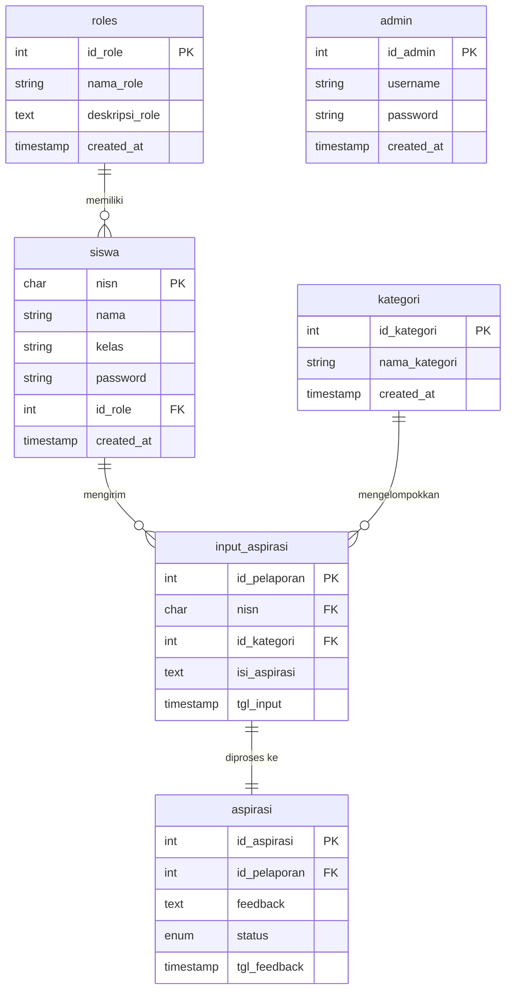

# Entity Relationship Diagram (ERD) - UKK Wiene2

Dokumen ini menjelaskan struktur data dan relasi antar tabel untuk aplikasi pengaduan/aspirasi sekolah.

## Diagram ERD

## Penjelasan Relasi

1.  **roles → siswa (1:N)**: Satu role dapat diberikan kepada banyak siswa/user.
2.  **siswa → input_aspirasi (1:N)**: Satu siswa dapat mengirimkan banyak laporan aspirasi.
3.  **kategori → input_aspirasi (1:N)**: Satu kategori dapat memiliki banyak laporan aspirasi yang terkait.
4.  **input_aspirasi → aspirasi (1:1)**: Setiap laporan aspirasi memiliki satu catatan status tindak lanjut (feedback dan status).

## Detail Tabel

### 1. roles
Menyimpan data peran pengguna seperti admin, siswa, ketua kelas, dan osis.

### 2. admin
Menyimpan data akun administrator sistem.

### 3. siswa
Menyimpan data identitas siswa dan kredensial login mereka.

### 4. kategori
Daftar kategori laporan (misalnya: Sarana & Prasarana, Kebersihan, dll).

### 5. input_aspirasi
Menyimpan data utama laporan yang dikirimkan oleh siswa, termasuk isi laporan dan waktu pengiriman.

### 6. aspirasi
Menyimpan status pemrosesan laporan (`menunggu`, `proses`, `selesai`) dan tanggapan dari pihak sekolah.
